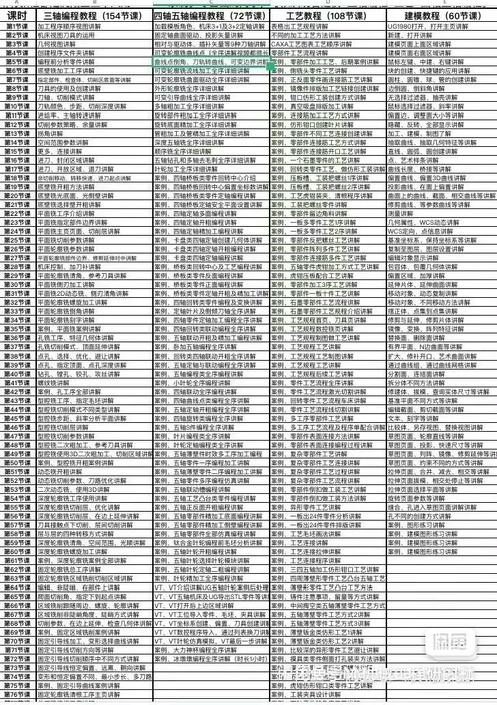
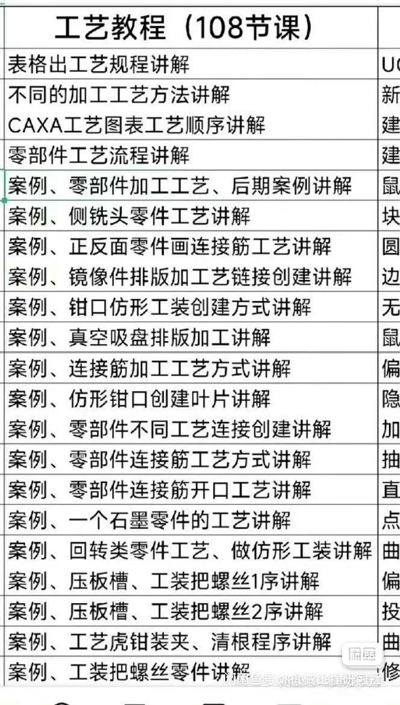

# UG1980 Aviation Parts Processing Technique Video Tutorial, The video tutorial includes materials.

## Body

UG1980 Aviation Part Processing Techniques Video Tutorial, Video Tutorial Includes Materials
UG1980 Aviation Part Processing Techniques Video Tutorial, Video Tutorial Includes Materials
UG1980 Aviation Part Processing Techniques Video Tutorial, Video Tutorial Includes Materials

UG1980 Aviation Part Processing Techniques Video Tutorial, Video Tutorial Includes Materials
Over 100 courses on aerospace part processing techniques + linking bars + cam tools + layout + and other tooling process tutorials
This product is replicable and cannot be returned once sold.

## Images

## Payment

Here is a pay link on Stripe ( https://buy.stripe.com/3cs8yP7sY87d0vu9AB ). Please contact me lonlonago@foxmail.com after funding $89, and I will send you a complete data files , thank you!

